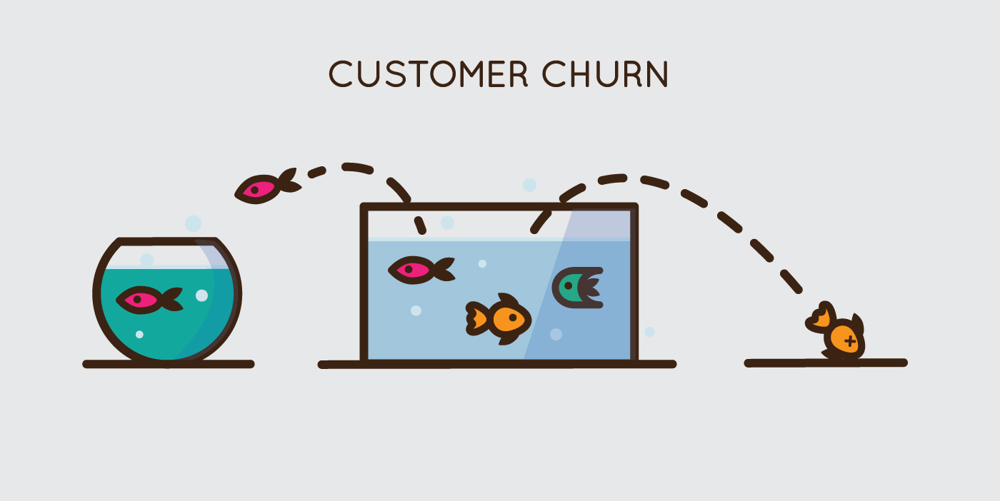

# Churn_Model
---

## Abstract
To unleash the full potential of any business, it is very crucial to understand your customers' behaviour before creating a new 
business scheme to predict what possible outcomes would it have on your firm's value in the mind's of the customers whether they would 
embrace the change or leave.  
Thus, a model that could predict the customers' behaviour based on the past records could provide a lot of valuable insights while shaping a new business scheme.
